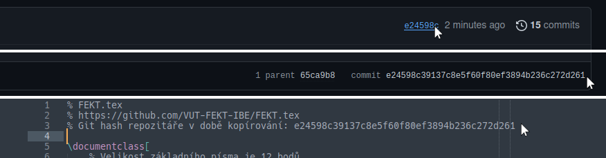

# FEKT.tex

LaTeX šablona pro sazbu studijních materiálů vytvořených studenty k přípravě na zkoušky.
Dokument obsahuje základní nastavení a představení různých funkcí.

## Použití

Nejjednodušší je stáhnout tento repozitář jako zip a nahrát jej do online LaTeX compileru [Overleaf](https://overleaf.com).

## GitHub releases

S pomocí GitHub Actions je nyní možné používat GitHub release na vydání nové verze pdf.
Stačí pouze nový commit v `main` větvi a GitHub Actions se o build a release postará.
Taktéž máme workflow pro kontrolu příchozích Pull Requestů, který neprojde pokud build selže.
Nejnovější release této šablony můžete vidět [zde](https://github.com/VUT-FEKT-IBE/FEKT.tex/releases/latest).

_Pozn.: Build se týká pouze souboru [`main.tex`](main.tex), proto byste neměli přidávat jiné hlavní .tex soubory._

### Co neupravovat: `shared.tex`

Obsah souboru [`shared.tex`](shared.tex) obsahuje kompletní nastavení stylu dokumentu.
Nikdy jej neupravujte, všechna případná doplnění provádějte v souboru `main.tex`.
V budoucnu tak bude možné vyměnit váš zkopírovaný soubor za novější a nepřijdete tak o žádné změny, které jste provedli.

Pokud zakládáte dlouhodobější projekt, proveďte následující krok:

- Zkopírujte git hash nejnovějšího commitu na GitHubu
- Vložte jej na třetí řádek v `shared.tex`

Takto budete mít lepší přehled o verzi vašeho `shared.tex` a budou se vám lépe kontrolovat aktualizace.

### Co upravovat: `main.tex`

Soubor [`main.tex`](main.tex) pak obsahuje konkrétní nastavení dokumentu.

| Příkaz       | Popis | Příklad |
|--------------|-------|---------|
| \subject     | Kód předmětu | BPC-SPR |
| \subjectname | Název předmětu | Softwarové právo |
| \authors     | Seznam autorů dokumentu | A, B, C |
| \corrections | Seznam korektorů gramatiky či oprav formátování | C, A |
| \docdesc     | (nepovinný) Popis dokumentu | Poznámky k předmětu |
| \docgroup    | (nepovinný) Cílová skupina dokumentu | Informační bezpečnost, FEKT VUT |
| \docurl      | (nepovinný) URL repozitáře | https://github.com/... |

Tento soubor si zkopírujte pouze jednou na začátku, k jeho aktualizacím by docházet nemělo.

### Kam psát: `text/`

Kam budete psát samotný text dokumentu je na vás.

Tento repozitář je připravený pro větší dokumenty a obsah se vkládá do `text/01.tex`.
Pro každý nově vytvořený soubor musíte také přidat `\include{}` ve vašem `main.tex`.

Pokud vytváříte menší dokument, může pro vás být přehlednější složku `text/` nepoužívat a vytvořit si nový textový soubor `text.tex` hned v kořenové složce; v tomto případě pak upravte `\include{}` volání ve vašem `main.tex`.

### Rozšíření pro případ více dokumentů

Pokud vytváříte více dokumentů v jednom repozitáři (viz státnicové otázky [bakalářského](https://github.com/VUT-FEKT-IBE/BPC-IBE-SZZ) a [magisterského](https://github.com/VUT-FEKT-IBE/MPC-IBE-SZZ) programu), můžete vytvořit soubor `.repo.tex`, který je načten a zpracován. V něm lze definovat proměnné platné pro celý repozitář a není tak nutné upravovat jednu hodnotu (např. popis dokumentu) ve všech `main` souborech, ale pouze v jednom kořenovém.

1 [x]

2 [x]

3 [x]

4 [x]

5 [x]

6 [x]

7 [x]

8 [x]

9 [x]

10 [x]

11 [x]

12 [x]

13 [ ]

14 [ ]

15 [ ]

16 [ ]

17 [ ]

18 [ ]

19 [ ]

20 [ ]

21 [ ]

22 [ ]

23 [ ]

24 [ ]

25 [x]

26 [x]

27 [x]

28 [x]

29 [x]

30 [x]

31 [ ]

32 [ ]

33 [ ]

34 [ ]

35 [ ]
